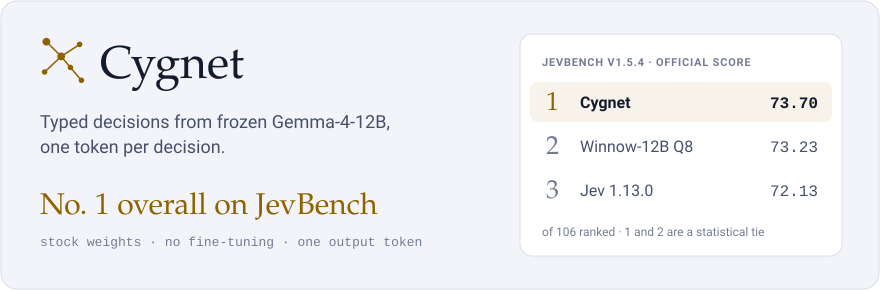
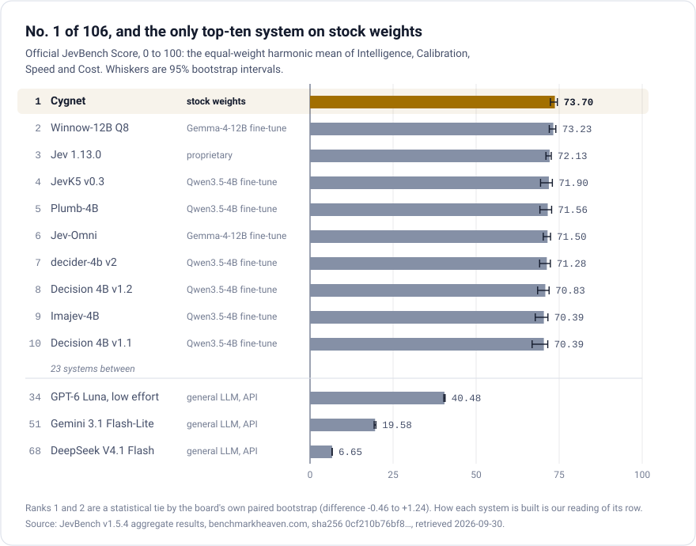
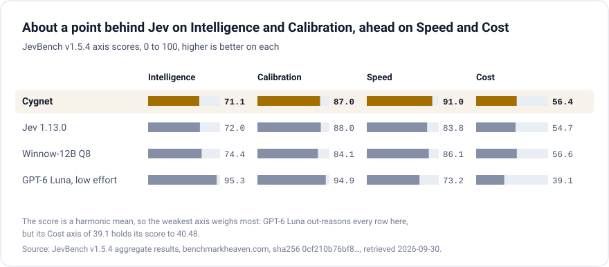

<p align="center">
  <picture>
    <source media="(prefers-color-scheme: dark)" srcset="showcase/hero-dark.svg">
    
  </picture>
</p>

<p align="center">
  <a href="#where-it-stands"></a>
  
  
  <a href="LICENSE"></a>
</p>

<p align="center">
  <a href="#where-it-stands">Where it stands</a> ·
  <a href="#run-it">Run it</a> ·
  <a href="#serving-applications">Serving applications</a> ·
  <a href="#how-the-readout-works">How the readout works</a> ·
  <a href="#disclosures">Disclosures</a>
</p>

Cygnet answers JevBench's typed decision requests (`choice`, `noul`, `score`) with **frozen
`google/gemma-4-12B-it`**, no fine-tuning, served by **unmodified vLLM 0.30.0**. A small shim presents the options
as letters, reads the model's own probability for each letter at a single answer position, and applies one
calibration temperature. Cost is input tokens only, with one output token per decision.

## Where it stands

**No. 1 overall of 106 ranked systems on [JevBench v1.5.4](https://benchmarkheaven.com/jev-models/v1.5.4)**, the
official release, measured by the benchmark's evaluators on their own GPU in an offline, read-only container: 1,624
decisions, 904 open and 720 sealed, all answered. Winnow-12B Q8, a fine-tune of the same Gemma-4-12B-it, is second;
the board calls the two joint leaders, a statistical tie by its own paired bootstrap. Every other system in the top
ten is fine-tuned or proprietary. The page opens on a different view, Capability (Intelligence and Calibration
alone, among systems within twice Jev's cost and latency), where Jev 1.13.0 leads at 80.0 and Cygnet is third at 79.0.

<p align="center">
  <picture>
    <source media="(prefers-color-scheme: dark)" srcset="showcase/board-dark.svg">
    
  </picture>
</p>

<p align="center">
  <picture>
    <source media="(prefers-color-scheme: dark)" srcset="showcase/axes-dark.svg">
    
  </picture>
</p>

| rank | system | score | Intelligence | Calibration | Speed | Cost |
|---:|---|---:|---:|---:|---:|---:|
| 1 | **Cygnet** | **73.70** | 71.1 | 87.0 | 91.0 | 56.4 |
| 2 | Winnow-12B Q8 | 73.23 | 74.4 | 84.1 | 86.1 | 56.6 |
| 3 | Jev 1.13.0 | 72.13 | 72.0 | 88.0 | 83.8 | 54.7 |
| 34 | GPT-6 Luna, low effort | 40.48 | 95.3 | 94.9 | 73.2 | 39.1 |
| 51 | Gemini 3.1 Flash-Lite | 19.58 | 77.6 | 74.7 | 80.0 | 29.8 |
| 68 | DeepSeek V4.1 Flash | 6.65 | 93.7 | 96.9 | 69.4 | 19.1 |

From the release's [aggregate results](https://benchmarkheaven.com/api/jevbench/v1.5.4), sha256
`0cf210b76bf85084a5f3fb40fb109e9a2c2f93df42ff6628696377666e89db45`, retrieved 2026-09-30. The score is the
equal-weight harmonic mean of the four axes; under the release's alternative weighting, option B (Intelligence 40 %),
Cygnet is second. How each system is built is our reading of its row. The public-set figures below are our own runs;
the official score also covers the 720 sealed decisions. `showcase/render.py` draws the pictures from these numbers.

## Measured (JevBench's public set)

All figures come from **JevBench's own CLI at commit `2fa63fa`**, `--adapter typesafe`, run on the public items
(`datasets/public/easy.jsonl`, `original.jsonl`, `hard.jsonl`; 231 items) with the commands below.

| | RTX A6000 48 GB | L40S 48 GB |
|---|---|---|
| correct | 203 / 231 (87.9 %) | 203 / 231 (87.9 %) |
| by tier: easy / standard / hard | 48/48 · 70/72 · 85/111 | 48/48 · 70/72 · 85/111 |
| answered and valid | 231 / 231 | 231 / 231 |
| mean input tokens per decision | 704 | 704 |
| latency p50 / p95, standard tier, serial | 0.066 s / 0.072 s | 0.050 s / 0.052 s |

The two cards gave the same answer on all 231 items; probabilities differ slightly between cards (by at most 0.165
on any option). The L40S run pinned the weights to revision `707f0a3b8a3c7ad586ed01e27eafbad8a27dd0f7`; the A6000
run fetched the repository's main branch without recording a revision. Both runs' per-item results, CLI manifests
and hashes are in `runs/` and `PROVENANCE.md`.

**Identity check for an evaluator:** a correct setup reproduces 203/231 with the tier split above, or 204/231 with
hard 86/111. One public item, `hard-sol-a-multi_hop-07`, sits on a near-tie between two options, and GPU batch order
can flip it: a third run with the pinned revision on an RTX A6000 (`runs/a6000-pinned/`) scored 204/231 and gave the
same answer as both runs above on the other 230 items.

## Run it

Hardware measured: one RTX A6000 (48 GB) and one L40S (48 GB). Other cards have not been measured. Docker image:
`vllm/vllm-openai:v0.30.0` (digest `sha256:8a69ffad015f138d7170c4ddc429e230a3bc1c1719f67e14324749df200a4b90`), or
`pip install vllm==0.30.0`.

**1. Serve the model** (the documented context limit is **16384 tokens**; longer inputs get HTTP 422):

```bash
vllm serve google/gemma-4-12B-it --revision 707f0a3b8a3c7ad586ed01e27eafbad8a27dd0f7 \
  --served-model-name cygnet --host 127.0.0.1 --port 8890 \
  --max-model-len 16384 --gpu-memory-utilization 0.90
```

**2. Start the shim on the same machine** (standard library only):

```bash
SHIM_VLLM=http://127.0.0.1:8890/v1/chat/completions SHIM_MODEL=cygnet SHIM_PORT=8009 SHIM_TEMPERATURE=3.4 \
python3 shim/cygnet_shim.py
```

`SHIM_MODEL` must match `--served-model-name`. Before answering, the shim reads the server's context limit; if the
server does not list `SHIM_MODEL`, reports no limit, or has less than 4096, it answers 503, so a misconfigured
server stops a run instead of scoring it.

**3. Warm up** until this returns HTTP 200:

```bash
curl -s http://127.0.0.1:8009/v1/systemone -H 'Content-Type: application/json' -d '{"state": "warm-up",
  "questions": {"decision": {"type": "noul", "instructions": "Is this a warm-up?",
  "criteria": {"true": "yes", "false": "no"}}}}'
```

**4. Run JevBench's harness**:

```bash
python3 -m jevbench.cli run \
  --tasks <JEVBENCH>/datasets/public/easy.jsonl,<JEVBENCH>/datasets/public/original.jsonl,<JEVBENCH>/datasets/public/hard.jsonl \
  --adapter typesafe --endpoint http://127.0.0.1:8009 --key-env '' \
  --model cygnet --cost-basis self_hosted_gpu --reserve-usd 0 \
  --results <OUT>/results.jsonl --raw-dir <OUT>/raw --ledger <OUT>/ledger.jsonl --manifest <OUT>/manifest.json \
  --run-label cygnet --delay-s 0
```

**Status codes.** An input the shim cannot take (over the context limit, more than 26 options, an unknown question
type) gets HTTP 422, which the runner scores as one wrong answer. vLLM's 401, 403 and 429 pass through; any other
vLLM failure is a 502, which counts toward the runner's three-consecutive-failures stop.

**Tests** (no GPU): `python3 shim/test_shim.py`.

## Apple Silicon (Metal)

The optional [Apple Metal backend](metal/README.md) runs the same shim with Google's
official Gemma 4 12B IT QAT Q4_0 checkpoint on a Mac. It is adapted from
[GemmaJev](https://github.com/dashidhy/GemmaJev) and preserves Cygnet's prompt,
letter-probability aggregation and calibration temperature. The guide includes
pinned model/runtime setup and public JevBench reproduction commands.

On an M2 Pro with 16 GB memory, the 231-item public subset scored **198/231
(85.71%)**, compared with **203–204/231** in the existing pinned BF16 GPU runs.
All 231 requests were valid. This is a public-subset portability result, not a
full JevBench leaderboard score; [metrics and limitations](metal/README.md#measured-public-subset-result)
include the calibration gap and local timing measurements.

## Serving applications

`shim/cygnet_shim.py` is the file the figures above were measured with, and it stays as it is. For applications,
`shim/decision_server.py` serves the same readout on the same API (`POST /v1/systemone`, `GET /v1/models`) and adds
what an application needs; clients of this API only need its base URL changed. Start it in place of step 2:

```bash
SHIM_VLLM=http://127.0.0.1:8890/v1/chat/completions SHIM_MODEL=cygnet SHIM_TEMPERATURE=3.4 CYGNET_PORT=8010 \
python3 shim/decision_server.py
```

- **Every question in a request is answered**, under the name the caller gave it. Names never reach the model; each
  question is read in its own pass, and questions run concurrently.
- **Answers:** a Choice returns `choice`, `probabilities` and `confidence`; a Score returns `score` (the
  probability-weighted level), `legend`, level-keyed `probabilities` and `confidence`; a Noul returns `noul`, the
  probability of yes. `confidence` is `(K · p_max − 1) / (K − 1)` over the K options or levels. Usage is
  `input_tokens` and `output_tokens`.
- **Noul criteria are optional.** The two options are always shown "false" first, the order the figures above were
  measured in, whatever order a request gives them.
- **Descriptions** may be text, JSON or null. Text is shown as it is; JSON follows the option name; a null Choice
  description shows the option name.
- **Up to 255 options.** Up to 20 are read in one pass (vLLM returns 20 log-probabilities). Past that the options are
  read in groups of near-equal size, then once more over the group winners, each with its own description:
  `P(option) = P(its group's winner) × P(option | its group)`, with the temperature applied once to the result. That
  is `ceil(K / 20) + 1` passes. The calibration temperature was fitted on single-pass reads; on grouped reads it
  lowered calibration error on 77 options and raised it on 150 (below), so it is not established there.
- On one question with at most 20 options, text descriptions and noul options given false first, it returns exactly
  what the benchmark shim returns (`shim/test_decision_server.py` checks this on every question type).

| setting | default | |
|---|---|---|
| `CYGNET_HOST`, `CYGNET_PORT` | `127.0.0.1`, `8010` | listen address |
| `CYGNET_API_KEY` | unset | when set, requests need `Authorization: Bearer <key>` (401 otherwise); without it the server will not listen beyond localhost |
| `CYGNET_ALLOW_NO_KEY` | unset | `1` lets it listen beyond localhost without a key, when something in front of it checks access |
| `CYGNET_MAX_PARALLEL` | 8 | vLLM requests in flight at once, across all requests and group passes; vLLM batches them |
| `CYGNET_GROUP_SIZE` | 20 | options read in one pass; 13 to 20, so that 255 options fit in one final pass |
| `CYGNET_MAX_BODY` | 16777216 | largest request body, in bytes (16 MiB) |
| `CYGNET_MODEL_NAME`, `CYGNET_MODEL_DESCRIPTION`, `CYGNET_MODEL_RELEASE_DATE` | `SHIM_MODEL`, … | what `GET /v1/models` lists |

**Status codes.** 401 without a valid key; 422 for a request the API does not accept (an unknown question type, more
than 255 options or 10 levels, over the context limit); vLLM's 401, 403 and 429 pass through ahead of a 422 in the same
request, since they concern the server; any other vLLM failure is a 502; 400 for a body that is not JSON, 411 without
a `Content-Length`, 413 over `CYGNET_MAX_BODY`. Errors are `{"error": "<message>"}`.

**Measured on the real model** (one H100 NVL, the settings above; `checks/decision-server/`):

- JevBench's CLI scored 203/231 through the decision server, with the same probabilities as the benchmark shim on all
  231 items.
- Grouped reads on 400 BANKING77 test messages with 20 intents each: 87.00 % grouped against 86.50 % in one pass (same
  option chosen on 373). All 77 BANKING77 intents: 73.50 %; all 150 CLINC150 intents: 91.25 %.
- Expected calibration error at T 3.4 against T 1: 0.067 against 0.249 on 77 intents, 0.171 against 0.074 on 150,
  where confidence sits below accuracy.
- Latency with 20 options: 0.062 s p50 for one client; 38.5 requests/s at 0.209 s p50 for 8 clients. With 77 options
  (5 passes): 0.193 s p50 for one client.

`python3 shim/test_decision_server.py` tests the server against a stand-in for vLLM (no GPU). Deployments are subject to
Google's Gemma Prohibited Use Policy (`NOTICE.md`).

**Serving on other backends:** forward `chat_template_kwargs: {"enable_thinking": false}` unchanged. llama.cpp turns
thinking on by default, which overrides Gemma-4's template; in a reproduction reported by @notf0und in issue #1 the answer
position was then led by a thinking marker and the easy tier fell from 48/48 to 42/48.

## How the readout works

<p align="center">
  <picture>
    <source media="(prefers-color-scheme: dark)" srcset="showcase/readout-dark.svg">
    
  </picture>
</p>

For each decision the shim sends one chat request with the state, the instructions and the options lettered A, B,
C…, asking for one letter. vLLM masks the answer position to the option letters (`structured_outputs.choice`) and
returns the top 20 log-probabilities. The shim sums the probability of every token that is an option letter,
renormalises over the options, and maps the letters back to the benchmark's labels.

- **Duplicate letter tokens.** Gemma-4's vocabulary has more than one token that decodes to the same letter. The
  shim keeps every (token, log-probability) pair and sums per letter; keeping them in a dictionary keyed by text
  would drop mass and flatten the distribution. `shim/test_shim.py` covers this case.
- **Calibration temperature.** Probabilities are raised to `1/T` and renormalised. `T = 3.4` was fitted by
  negative log-likelihood on 241 items we generated ourselves; **JevBench's public items were never used for the
  fit**, only to measure. Fitting the same way on 121 of those items (T = 3.1) and testing on the other 120 lowered
  expected calibration error from 0.140 to 0.101 on the held-out half. `SHIM_TEMPERATURE=1.0` turns it off. `calibration/fit.py`
  reproduces the fit from the packaged items and reads.
- **Structured state** (a JSON object instead of text) is rendered with `json.dumps(..., indent=1)`, which is how
  every figure above was measured. JevBench's reference `openai_compat` adapter renders compactly.

## Disclosures

- The options are presented as letters in the benchmark's own label order, with every label's criteria text
  verbatim. The letter presentation is ours.
- Price basis for an evaluator: this is Google's `gemma-4-12B-it` at bf16, one output token per decision, 704 mean
  input tokens on the public set.
- No network calls other than the local vLLM server; no rules keyed to benchmark items' wording, ids or answers.

## Licence and credits

`shim/` and the documentation: MIT (`LICENSE`). Weights: Google DeepMind's Gemma-4-12B-it, Apache-2.0, subject to
Google's Gemma Prohibited Use Policy — see `NOTICE.md`. The one-token readout approach is
[NInfer](https://github.com/igorls/ninfer)'s — see `CREDITS.md`.
